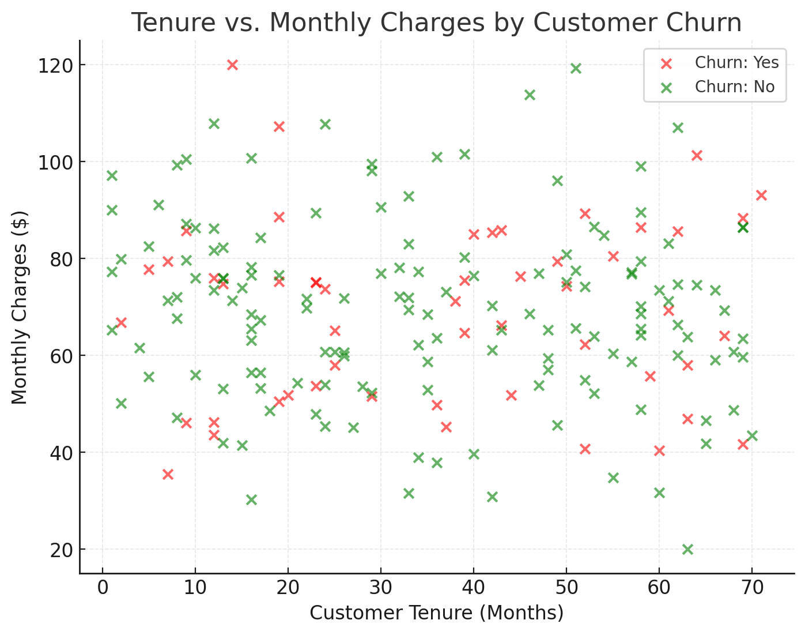

# Data-Analytics-2
# Customer Churn Analysis for a Telecom Company  

Customer churn—the rate at which clients discontinue their service—remains a key concern in subscription-based industries such as telecommunications. To illustrate an analytical workflow, we examine a synthetic dataset of 200 telecom customers. The dataset includes three key variables: **Monthly Charges** (the amount billed to a customer), **Tenure** (length of time the customer has been with the company), and **Churn** (whether the customer left the service).  

## Findings
On average, monthly charges are around **$69** for both churned and non-churned customers. Specifically, customers who stayed (“No”) had mean monthly charges of **$69.21**, while those who churned (“Yes”) averaged **$69.08**. This similarity suggests that pricing alone may not be a strong determinant of churn in this sample.  

The tenure variable is more informative: customers with shorter tenures are visibly more prone to churn, while longer-tenured customers tend to remain loyal. This aligns with retention theory—newer customers are more vulnerable to dissatisfaction, while established customers develop switching costs and habits that reduce churn likelihood.  

The scatter plot below shows **Tenure (x-axis)** against **Monthly Charges (y-axis)**, colored by churn status.  

- **Red points (Churn = Yes):** These cluster heavily at lower tenure levels, reinforcing that newer customers are at greater risk of leaving.  
- **Green points (Churn = No):** These are more widely distributed, with many stretching toward the higher end of tenure, indicating stronger retention.  
- Interestingly, the vertical distribution of monthly charges overlaps significantly across churn and non-churn groups, confirming that tenure, not pricing, is the dominant predictor in this dataset.  

## Summary 
This exploratory analysis demonstrates how combining descriptive statistics with visualization allows us to uncover patterns in customer behavior. While monthly charges may not strongly predict churn, **tenure emerges as a critical factor**—indicating that targeted retention strategies should focus on newer customers, perhaps through onboarding support, loyalty incentives, or proactive service outreach.  
